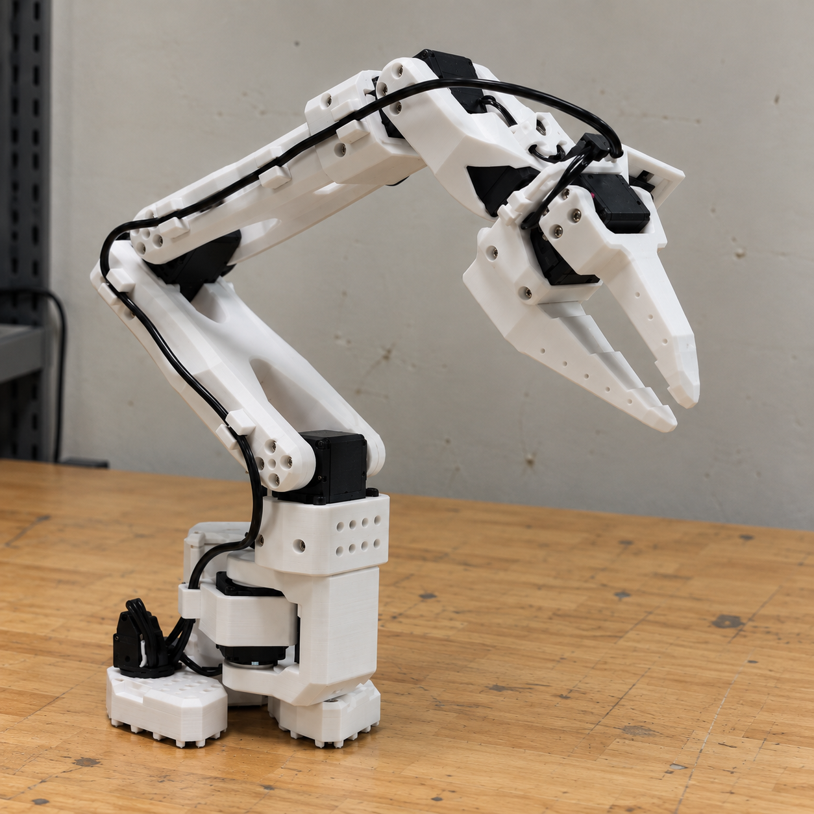

# LeRobot-Inspired Three-Link Robotic Arm

**Status:** Ongoing · October 2026–present  
**Area:** Robotics, manipulators

A three-link robotic arm project inspired by the LeRobot ecosystem. The goal is to coordinate manipulator hardware, actuation, and software interfaces.

## Project image

Hardware details, control work, and results will be documented here as they become available.
